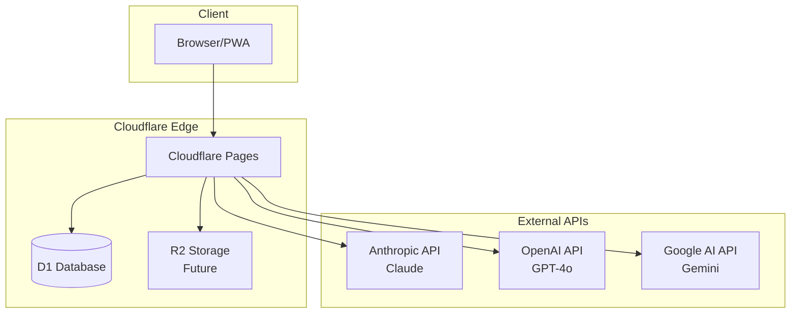
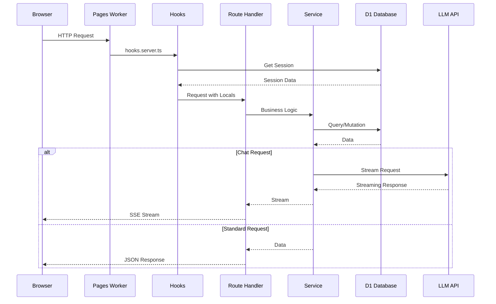

# Architecture Overview

## System Architecture

The Council is a multi-LLM advisory platform built with a modern serverless stack optimized for Cloudflare's edge network.



## Technology Stack

| Layer | Technology | Purpose |
|-------|-----------|---------|
| **Frontend** | SvelteKit | Full-stack framework with SSR |
| **Styling** | Tailwind CSS v4 + DaisyUI v5 | Utility-first CSS with component library |
| **Database** | Cloudflare D1 | Serverless SQLite at the edge |
| **ORM** | Drizzle | Type-safe SQL queries |
| **Auth** | Better Auth + Passkeys | WebAuthn-based authentication |
| **AI** | Vercel AI SDK | Multi-provider LLM integration with streaming |
| **Hosting** | Cloudflare Pages | Edge deployment with D1 bindings |

## Application Layers

```mermaid
graph TD
    subgraph "Presentation Layer"
        Routes[SvelteKit Routes]
        Components[Svelte Components]
        Stores[Svelte Stores]
    end

    subgraph "API Layer"
        AuthAPI[/api/auth/*]
        ChatAPI[/api/chat]
        ProjectsAPI[/api/projects]
        PersonasAPI[/api/personas]
    end

    subgraph "Service Layer"
        AuthService[Auth Service]
        ChatService[Chat Service]
        ProjectService[Project Service]
        PersonaService[Persona Service]
        MessageService[Message Service]
    end

    subgraph "Data Layer"
        DrizzleORM[Drizzle ORM]
        D1DB[(D1 Database)]
    end

    Routes --> Components
    Components --> Stores
    Routes --> AuthAPI
    Routes --> ChatAPI
    Routes --> ProjectsAPI
    Routes --> PersonasAPI

    AuthAPI --> AuthService
    ChatAPI --> ChatService
    ChatAPI --> MessageService
    ProjectsAPI --> ProjectService
    PersonasAPI --> PersonaService

    AuthService --> DrizzleORM
    ChatService --> DrizzleORM
    ProjectService --> DrizzleORM
    PersonaService --> DrizzleORM
    MessageService --> DrizzleORM

    DrizzleORM --> D1DB
```

## Request Flow



## File Structure

```
ai-council/
├── docs/                    # Architecture documentation
├── drizzle/
│   └── migrations/          # SQL migrations
├── src/
│   ├── lib/
│   │   ├── components/      # Svelte components
│   │   │   ├── chat/        # Chat UI components
│   │   │   └── ui/          # Base UI components
│   │   ├── server/
│   │   │   ├── ai/          # AI provider configuration
│   │   │   ├── db/          # Database schema and client
│   │   │   └── services/    # Business logic services
│   │   └── auth-client.ts   # Client-side auth
│   ├── routes/
│   │   ├── (auth)/          # Public auth routes
│   │   ├── (app)/           # Authenticated routes
│   │   └── api/             # API endpoints
│   ├── app.css              # Global styles
│   ├── app.d.ts             # TypeScript declarations
│   ├── app.html             # HTML template
│   └── hooks.server.ts      # Server hooks
├── drizzle.config.ts        # Drizzle Kit configuration
├── svelte.config.js         # SvelteKit configuration
├── vite.config.ts           # Vite configuration
└── wrangler.toml            # Cloudflare configuration
```

## Environment Configuration

### Development
- Local D1 database via Wrangler
- Hot module replacement via Vite
- Storybook for component development

### Production
- D1 database on Cloudflare
- Edge deployment via Cloudflare Pages
- Secrets managed via Wrangler

### Required Environment Variables

```bash
# Cloudflare (for Drizzle Kit)
CLOUDFLARE_ACCOUNT_ID=
CLOUDFLARE_DATABASE_ID=
CLOUDFLARE_D1_TOKEN=

# AI Providers (set via wrangler secret)
ANTHROPIC_API_KEY=
OPENAI_API_KEY=
GOOGLE_AI_API_KEY=

# Auth
BETTER_AUTH_SECRET=
BETTER_AUTH_URL=
```
