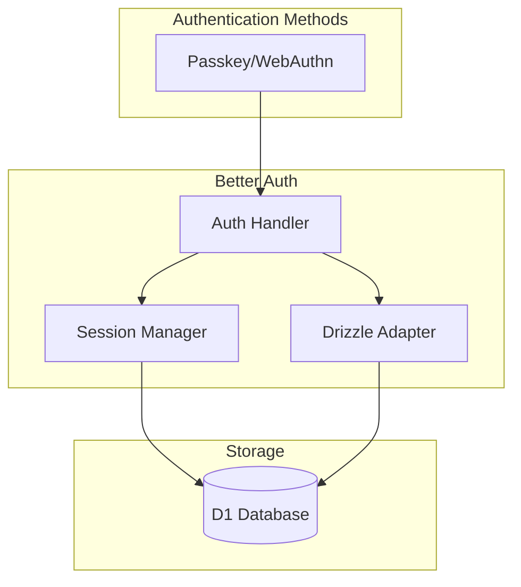
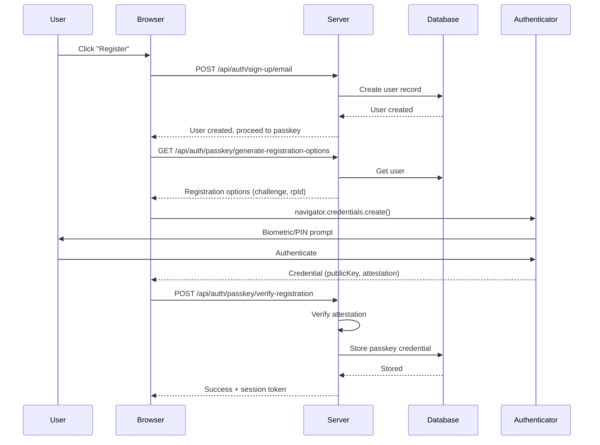
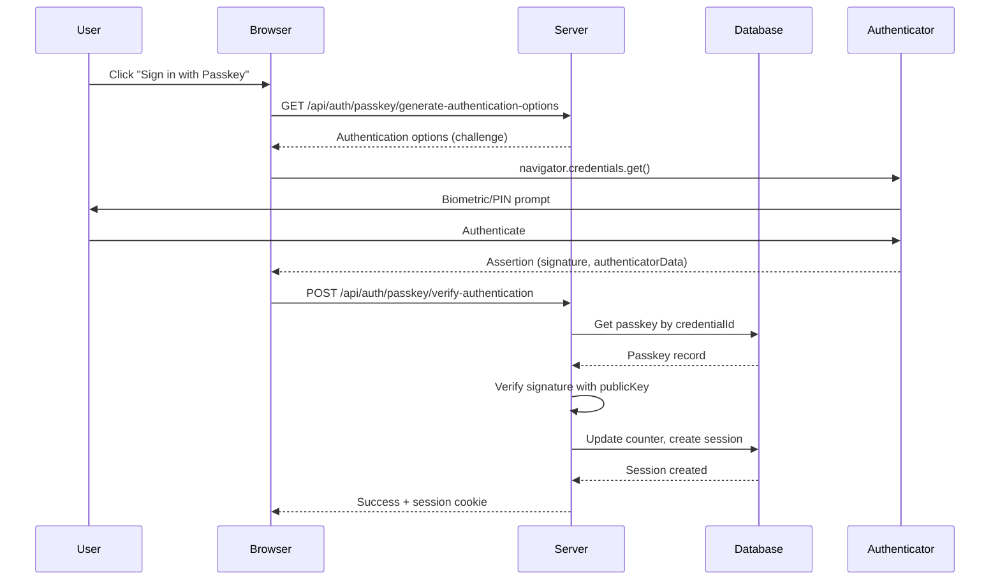

# Authentication System

The Council uses Better Auth with WebAuthn passkeys for secure, passwordless authentication.

## Overview



## Passkey Authentication Flow

### Registration



### Authentication



## Configuration

### Server-side (`src/lib/server/auth.ts`)

```typescript
import { betterAuth } from 'better-auth';
import { drizzleAdapter } from 'better-auth/adapters/drizzle';
import { passkey } from '@better-auth/passkey';

export function createAuth(d1: D1Database, baseURL: string) {
  const db = drizzle(d1, { schema });

  return betterAuth({
    database: drizzleAdapter(db, {
      provider: 'sqlite',
      schema: {
        user: schema.users,
        session: schema.sessions,
        account: schema.accounts,
        verification: schema.verifications
      }
    }),
    baseURL,
    plugins: [
      passkey({
        rpID: baseURL.includes('localhost') ? 'localhost' : new URL(baseURL).hostname,
        rpName: 'The Council',
        origin: baseURL
      })
    ],
    session: {
      expiresIn: 60 * 60 * 24 * 30, // 30 days
      updateAge: 60 * 60 * 24       // Update daily
    }
  });
}
```

### Client-side (`src/lib/auth-client.ts`)

```typescript
import { createAuthClient } from 'better-auth/svelte';
import { passkeyClient } from '@better-auth/passkey/client';

export const authClient = createAuthClient({
  baseURL: typeof window !== 'undefined' ? window.location.origin : '',
  plugins: [passkeyClient()]
});

export const {
  signIn,
  signOut,
  signUp,
  useSession,
  passkey: { registerPasskey, authenticateWithPasskey }
} = authClient;
```

## Session Management

### Server Hooks (`src/hooks.server.ts`)

```typescript
export const handle: Handle = async ({ event, resolve }) => {
  // Initialize database
  const db = createDb(event.platform!.env.DB);
  event.locals.db = db;

  // Initialize auth and get session
  const auth = createAuth(event.platform!.env.DB, event.url.origin);
  const session = await auth.api.getSession({
    headers: event.request.headers
  });

  event.locals.session = session?.session ?? null;
  event.locals.user = session?.user ?? null;

  return resolve(event);
};
```

### Protected Routes

Routes under `(app)` group require authentication:

```typescript
// src/routes/(app)/+layout.server.ts
export const load: LayoutServerLoad = async ({ locals }) => {
  if (!locals.user) {
    throw redirect(302, '/login');
  }
  return { user: locals.user };
};
```

## Security Considerations

### WebAuthn Benefits
- **Phishing-resistant**: Credentials bound to origin
- **No password storage**: Only public keys stored server-side
- **Biometric protection**: Device-level authentication
- **Replay protection**: Challenge-response with counter

### Session Security
- HTTP-only cookies
- 30-day expiration
- Daily session refresh
- IP/User-Agent tracking

### D1/SQLite Constraints
- Using Better Auth's SQLite adapter
- Scrypt hashing avoided (Cloudflare Workers timeout)
- Passkey-only authentication recommended

## API Endpoints

| Method | Endpoint | Description |
|--------|----------|-------------|
| POST | `/api/auth/sign-up/email` | Create account with email |
| GET | `/api/auth/passkey/generate-registration-options` | Get WebAuthn registration challenge |
| POST | `/api/auth/passkey/verify-registration` | Verify and store passkey |
| GET | `/api/auth/passkey/generate-authentication-options` | Get WebAuthn auth challenge |
| POST | `/api/auth/passkey/verify-authentication` | Verify passkey and create session |
| POST | `/api/auth/sign-out` | End session |
| GET | `/api/auth/session` | Get current session |
