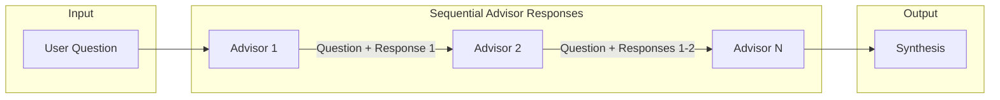
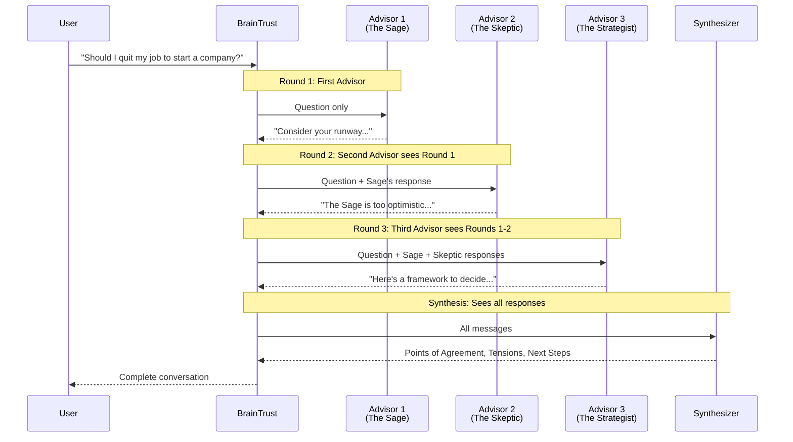
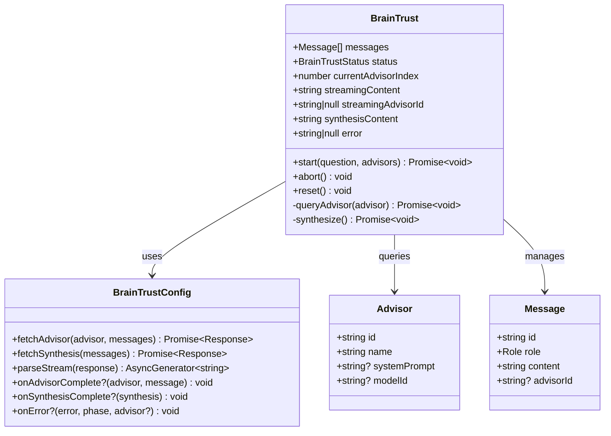
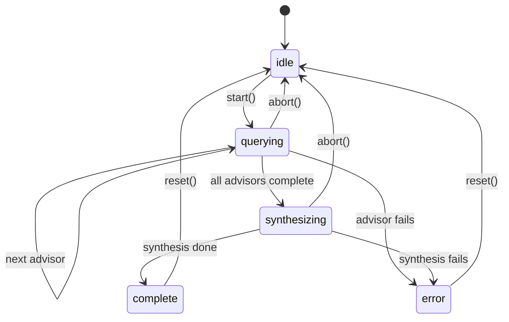
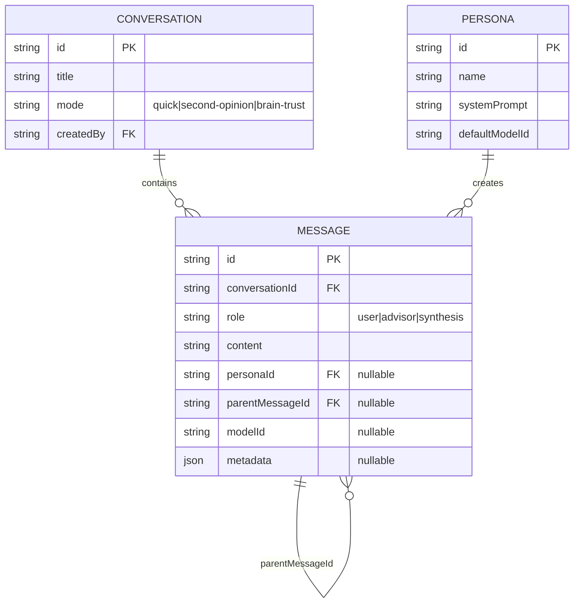
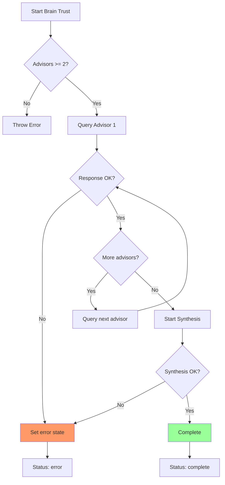

# Brain Trust - Multi-Advisor Orchestration

The Brain Trust feature enables consulting multiple AI advisors sequentially on a single question, with each advisor able to see and respond to previous advisors' perspectives. A synthesis is automatically generated after all advisors complete.

## Overview



## Key Design Decision: Sequential Context Sharing

Advisors respond **sequentially**, not in parallel. This enables:

1. **Debate**: Later advisors can disagree with earlier perspectives
2. **Devil's Advocate**: An advisor can explicitly challenge previous responses
3. **Building On Ideas**: Advisors can extend or refine earlier suggestions
4. **Critique**: Identify weaknesses in previous reasoning



## Architecture

### Package Structure

The Brain Trust is implemented as a self-contained, potentially publishable package:

```
src/lib/brain-trust/
├── index.ts                    # Public API exports
├── brain-trust.svelte.ts       # Core state machine (Svelte 5 runes)
├── types.ts                    # TypeScript interfaces
└── stream-parser.ts            # SSE stream parsing utilities
```

### Class Diagram



### State Machine



## API Endpoints

### POST /api/chat (Brain Trust Mode)

Used for each advisor query. In Brain Trust mode, includes `mode` and `parentMessageId` fields.

**Request:**
```json
{
  "personaId": "persona_sage",
  "conversationId": "conv_xyz789",
  "mode": "brain-trust",
  "parentMessageId": "msg_user123",
  "messages": [
    { "role": "user", "content": "Should I quit my job?" },
    { "role": "assistant", "content": "Previous advisor response..." }
  ]
}
```

**Response Headers:**
- `X-Conversation-Id`: The conversation ID (created on first request)
- `X-User-Message-Id`: The database ID of the saved user message

**Response Body:** Server-Sent Events (SSE) stream

### POST /api/chat/synthesis

Generates a synthesis of all advisor responses.

**Request:**
```json
{
  "conversationId": "conv_xyz789",
  "userQuestionId": "msg_user123"
}
```

**Response Body:** SSE stream with synthesis content

### Brain Trust System Prompt Addendum

In Brain Trust mode, each advisor's system prompt is automatically enhanced with instructions to engage with other advisors' perspectives:

```
IMPORTANT: You are participating in a "Brain Trust" discussion with other advisors.
If you see responses from other advisors in the conversation:
- Acknowledge their perspectives where relevant
- Offer your unique viewpoint that adds to or contrasts with what's been said
- Don't simply repeat what others have already covered
- Feel free to respectfully disagree or challenge other advisors' positions
- Build on good ideas from others while adding your own expertise
```

This ensures advisors don't just repeat each other but actively engage in debate and critique.

### Synthesis System Prompt

The synthesizer uses a dedicated prompt to create structured output:

```
You are the Council Synthesizer, responsible for distilling insights
from multiple advisors.

Given responses from different advisors, create a synthesis with these sections:

## Points of Agreement
Where advisors align in perspectives or recommendations.

## Key Tensions
Where advisors disagree. Explain tensions without artificially resolving them.

## Recommended Next Steps
Concrete actions accounting for different perspectives.

Guidelines:
- Be concise but comprehensive
- Don't favor any single advisor
- Acknowledge uncertainty
- Focus on actionable insights
```

## Data Flow

```mermaid
flowchart TB
    subgraph Client
        CV[ChatView.svelte]
        BT[BrainTrust Class]
        SP[Stream Parser]
    end

    subgraph "API Layer"
        CA[/api/chat]
        SA[/api/chat/synthesis]
    end

    subgraph Services
        PS[PersonaService]
        MS[MessageService]
        CS[ConversationService]
    end

    subgraph "AI Providers"
        LLM1[Claude]
        LLM2[GPT-4o]
        LLM3[Gemini]
    end

    subgraph Database
        D1[(D1)]
    end

    CV -->|"1. start(question, advisors)"| BT
    BT -->|"2. fetchAdvisor()"| CA
    CA -->|"3. Get persona"| PS
    CA -->|"4. Save user msg"| MS
    CA -->|"5. streamText()"| LLM1
    LLM1 -->|"6. SSE stream"| CA
    CA -->|"7. Save advisor msg"| MS
    CA -->|"8. Stream"| SP
    SP -->|"9. Chunks"| BT

    BT -->|"10. Repeat for each advisor"| CA

    BT -->|"11. fetchSynthesis()"| SA
    SA -->|"12. getByParentId()"| MS
    SA -->|"13. streamText()"| LLM1
    SA -->|"14. Save synthesis"| MS
    SA -->|"15. Stream"| SP

    PS --> D1
    MS --> D1
    CS --> D1
```

## Usage Example

### Basic Usage

```svelte
<script lang="ts">
  import { BrainTrust, parseAISDKStream } from '$lib/brain-trust';
  import type { Advisor } from '$lib/brain-trust';

  const brainTrust = new BrainTrust({
    fetchAdvisor: async (advisor, messages) => {
      return fetch('/api/chat', {
        method: 'POST',
        headers: { 'Content-Type': 'application/json' },
        body: JSON.stringify({
          personaId: advisor.id,
          messages: messages.map(m => ({
            role: m.role === 'advisor' ? 'assistant' : m.role,
            content: m.content
          })),
          mode: 'brain-trust'
        })
      });
    },
    fetchSynthesis: async (messages) => {
      return fetch('/api/chat/synthesis', {
        method: 'POST',
        headers: { 'Content-Type': 'application/json' },
        body: JSON.stringify({
          conversationId: currentConversationId,
          userQuestionId: messages[0].id
        })
      });
    },
    parseStream: parseAISDKStream
  });

  const advisors: Advisor[] = [
    { id: '1', name: 'The Sage' },
    { id: '2', name: 'The Skeptic' },
    { id: '3', name: 'The Strategist' }
  ];

  async function askQuestion() {
    await brainTrust.start('Should I quit my job?', advisors);
  }
</script>

<!-- Completed messages -->
{#each brainTrust.messages as message}
  {#if message.role === 'user'}
    <UserBubble content={message.content} />
  {:else if message.role === 'advisor'}
    <AdvisorCard advisorId={message.advisorId} content={message.content} />
  {/if}
{/each}

<!-- Currently streaming advisor -->
{#if brainTrust.streamingAdvisorId}
  <AdvisorCard
    advisorId={brainTrust.streamingAdvisorId}
    content={brainTrust.streamingContent}
    isStreaming={true}
  />
{/if}

<!-- Synthesis -->
{#if brainTrust.synthesisContent}
  <SynthesisCard
    content={brainTrust.synthesisContent}
    isStreaming={brainTrust.status === 'synthesizing'}
  />
{/if}

<!-- Progress indicator -->
{#if brainTrust.isActive}
  <Progress
    current={brainTrust.progress.current}
    total={brainTrust.progress.total}
    phase={brainTrust.progress.phase}
  />
{/if}
```

### Reactive State Properties

| Property | Type | Description |
|----------|------|-------------|
| `messages` | `Message[]` | All completed messages (user + advisor) |
| `status` | `BrainTrustStatus` | Current phase: `idle`, `querying`, `synthesizing`, `complete`, `error` |
| `currentAdvisorIndex` | `number` | Index of current advisor (0-based) |
| `streamingContent` | `string` | Content being streamed from current advisor |
| `streamingAdvisorId` | `string \| null` | ID of advisor currently streaming |
| `synthesisContent` | `string` | Accumulated synthesis content |
| `error` | `string \| null` | Error message if status is `error` |

### Computed Properties

| Property | Type | Description |
|----------|------|-------------|
| `currentAdvisor` | `Advisor \| null` | The currently active advisor |
| `isComplete` | `boolean` | True if status is `complete` or `error` |
| `isActive` | `boolean` | True if status is `querying` or `synthesizing` |
| `progress` | `BrainTrustProgress` | Progress info for UI display |
| `completedAdvisors` | `Advisor[]` | Advisors that have finished responding |

## Stream Parsing

The `parseAISDKStream` function handles the Vercel AI SDK v5 SSE format:

```typescript
// SSE format from AI SDK
data: {"type": "text-delta", "delta": "Hello"}
data: {"type": "text-delta", "delta": " world"}
data: {"type": "finish", ...}
data: [DONE]

// parseAISDKStream yields text chunks
for await (const chunk of parseAISDKStream(response)) {
  console.log(chunk); // "Hello", " world"
}
```

## Database Schema

Messages are linked via `parentMessageId`:



### Message Linking

For a Brain Trust conversation with 3 advisors:

```
User Question (id: msg_q1)
├── Advisor 1 Response (parentMessageId: msg_q1)
├── Advisor 2 Response (parentMessageId: msg_q1)
├── Advisor 3 Response (parentMessageId: msg_q1)
└── Synthesis (parentMessageId: msg_q1)
```

The synthesis endpoint uses `getByParentId(userQuestionId)` to fetch all advisor responses.

## Error Handling



### Error Recovery

- Individual advisor errors abort the entire flow
- The `abort()` method can be called to stop mid-flow
- `reset()` clears all state for a fresh start
- Error callbacks via `onError` config option

## Testing Checklist

- [ ] Quick mode still works with Chat class
- [ ] Brain Trust: First advisor response streams and displays
- [ ] Brain Trust: Second advisor response streams and displays
- [ ] Brain Trust: Second advisor can reference first advisor's points
- [ ] Brain Trust: All completed responses visible without refresh
- [ ] Brain Trust: Synthesis streams and displays after all advisors
- [ ] Brain Trust: Error handling shows errors inline
- [ ] Brain Trust: Abort mid-flow works correctly
- [ ] Refresh page mid-conversation loads correctly

## Future Enhancements

1. **Parallel Mode**: Option to query advisors in parallel (loses context sharing)
2. **Selective Synthesis**: Choose which advisors to include in synthesis
3. **Custom Synthesis Prompts**: User-defined synthesis instructions
4. **Advisor Ordering**: Drag-and-drop to reorder advisors
5. **Conversation Branching**: Ask follow-up questions to specific advisors
