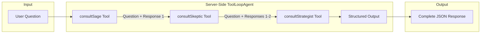
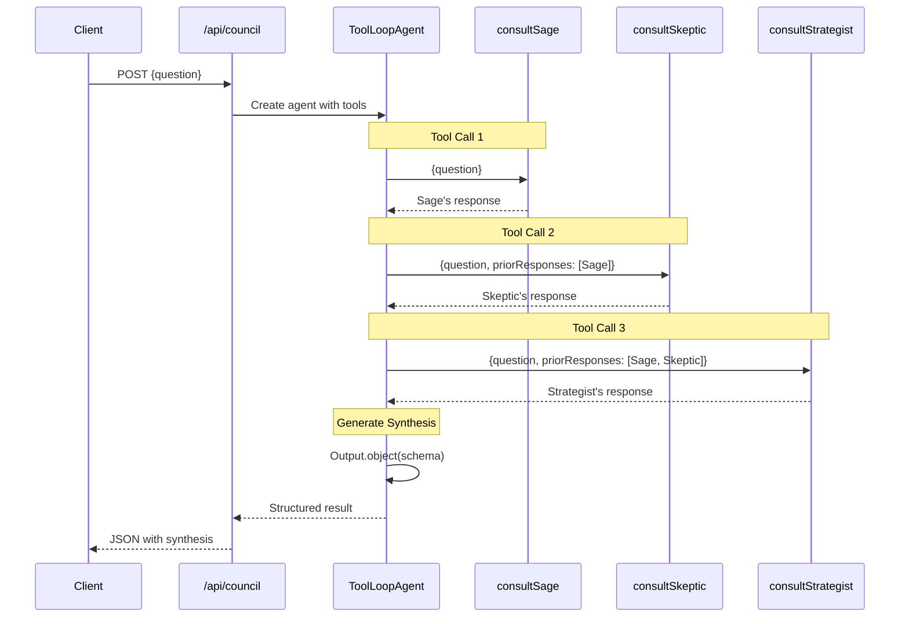
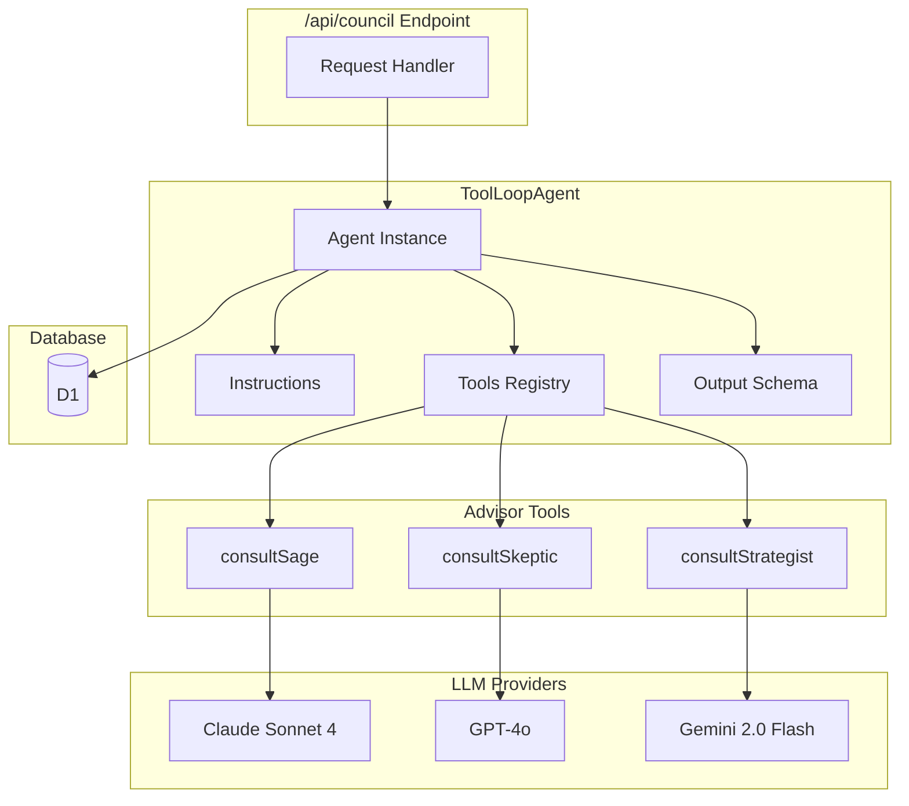
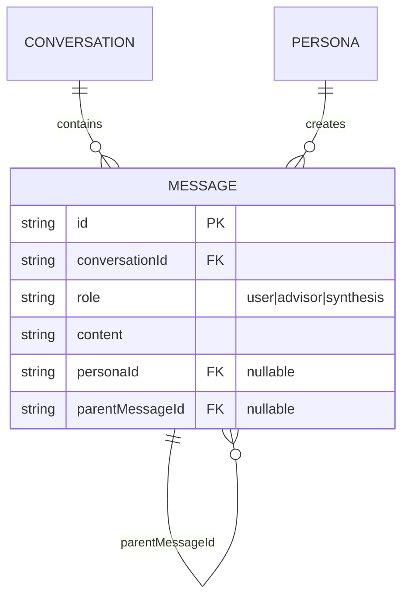

# Brain Trust - Multi-Advisor Orchestration with AI SDK 6

The Brain Trust feature enables consulting multiple AI advisors sequentially on a single question, with each advisor able to see and respond to previous advisors' perspectives. A synthesis is automatically generated after all advisors complete.

## Overview



## Key Design Decision: Sequential Context Sharing

Advisors respond **sequentially**, not in parallel. This enables:

1. **Debate**: Later advisors can disagree with earlier perspectives
2. **Devil's Advocate**: An advisor can explicitly challenge previous responses
3. **Building On Ideas**: Advisors can extend or refine earlier suggestions
4. **Critique**: Identify weaknesses in previous reasoning



## Architecture (AI SDK 6)

### Server-Side Orchestration

The Brain Trust is now implemented entirely server-side using AI SDK 6's ToolLoopAgent. This replaces the previous client-side BrainTrust class.

```
src/lib/server/ai/
├── providers.ts              # Model configuration with DevTools
├── advisor-tools.ts          # Tool wrappers for each advisor
└── council-agent.ts          # ToolLoopAgent configuration
```

### ToolLoopAgent Flow



## Implementation

### 1. Advisor Tools (`src/lib/server/ai/advisor-tools.ts`)

Each persona is wrapped as a tool that the agent can invoke:

```typescript
import { tool, generateText } from 'ai';
import { z } from 'zod';
import { getModel } from './providers';
import type { Persona } from '$lib/server/db/schema';

export function createAdvisorTool(persona: Persona, env: Record<string, string>) {
  return tool({
    description: `Consult ${persona.name} (${persona.role})`,
    inputSchema: z.object({
      question: z.string().describe('The user question to address'),
      priorResponses: z
        .array(z.object({
          advisorName: z.string(),
          advisorRole: z.string(),
          response: z.string()
        }))
        .optional()
        .describe('Responses from advisors consulted before this one')
    }),
    execute: async ({ question, priorResponses }) => {
      const model = getModel(persona.defaultModelId, env);

      // Build context with prior responses
      let contextPrompt = `User Question: ${question}`;
      if (priorResponses?.length) {
        contextPrompt += '\n\nPrior Advisor Responses:\n';
        for (const prior of priorResponses) {
          contextPrompt += `\n### ${prior.advisorName} (${prior.advisorRole})\n${prior.response}\n`;
        }
      }

      const result = await generateText({
        model,
        system: persona.systemPrompt,
        prompt: contextPrompt
      });

      return {
        advisorId: persona.id,
        advisorName: persona.name,
        advisorRole: persona.role,
        response: result.text
      };
    }
  });
}
```

### 2. Council Agent (`src/lib/server/ai/council-agent.ts`)

The ToolLoopAgent orchestrates the three advisors and generates structured output:

```typescript
import { ToolLoopAgent, Output } from 'ai';
import { z } from 'zod';
import { createAdvisorTool } from './advisor-tools';
import { getModel, SYNTHESIS_MODEL_ID } from './providers';
import type { Persona } from '$lib/server/db/schema';

const synthesisSchema = z.object({
  pointsOfAgreement: z.array(z.string()),
  keyTensions: z.array(z.object({
    topic: z.string(),
    sagePosition: z.string().optional(),
    skepticPosition: z.string().optional(),
    strategistPosition: z.string().optional()
  })),
  recommendedNextSteps: z.array(z.string()),
  rawAdvisorResponses: z.array(z.object({
    advisorName: z.string(),
    response: z.string()
  }))
});

export function createCouncilAgent(personas: Persona[], env: Record<string, string>) {
  const sage = personas.find((p) => p.name === 'The Sage');
  const skeptic = personas.find((p) => p.name === 'The Skeptic');
  const strategist = personas.find((p) => p.name === 'The Strategist');

  if (!sage || !skeptic || !strategist) {
    throw new Error('Missing required personas');
  }

  return new ToolLoopAgent({
    model: getModel(SYNTHESIS_MODEL_ID, env),
    instructions: `You are the Council Orchestrator. For each user question, you MUST:

1. Call consultSage with just the user question
2. Call consultSkeptic with the question AND The Sage's response
3. Call consultStrategist with the question AND both prior responses
4. After all three advisors respond, synthesize into the structured output

CRITICAL: Always call advisors in this exact order. Each subsequent advisor must receive all prior responses.`,
    tools: {
      consultSage: createAdvisorTool(sage, env),
      consultSkeptic: createAdvisorTool(skeptic, env),
      consultStrategist: createAdvisorTool(strategist, env)
    },
    output: Output.object({ schema: synthesisSchema })
  });
}
```

### 3. API Endpoint (`src/routes/api/council/+server.ts`)

The endpoint creates the agent and executes it with streaming:

```typescript
import { createCouncilAgent } from '$lib/server/ai/council-agent';
import { PersonaService } from '$lib/server/services/personas';
import { ConversationService } from '$lib/server/services/conversations';
import { MessageService } from '$lib/server/services/messages';

export const POST: RequestHandler = async ({ request, locals, platform }) => {
  if (!locals.user) {
    return new Response('Unauthorized', { status: 401 });
  }

  const { question, conversationId } = await request.json();

  const personaService = new PersonaService(locals.db);
  const conversationService = new ConversationService(locals.db);
  const messageService = new MessageService(locals.db);

  // Get default personas and create agent
  const personas = await personaService.getDefaults();
  const agent = createCouncilAgent(personas, {
    ANTHROPIC_API_KEY: platform?.env?.ANTHROPIC_API_KEY ?? '',
    OPENAI_API_KEY: platform?.env?.OPENAI_API_KEY ?? '',
    GOOGLE_AI_API_KEY: platform?.env?.GOOGLE_AI_API_KEY ?? ''
  });

  // Stream agent execution
  const stream = agent.stream({ prompt: question });

  // Create Server-Sent Events stream
  const encoder = new TextEncoder();
  const readable = new ReadableStream({
    async start(controller) {
      // Send metadata
      controller.enqueue(encoder.encode(
        `data: ${JSON.stringify({ type: 'metadata', conversationId, userMessageId })}\n\n`
      ));

      // Stream advisor responses as tool results complete
      for await (const event of stream.fullStream) {
        if (event.type === 'tool-result') {
          const advisor = event.result;
          // Stream to client immediately
          controller.enqueue(encoder.encode(
            `data: ${JSON.stringify({ type: 'advisor-response', advisor })}\n\n`
          ));
          // Save to database
          await messageService.create({ ... });
        }
      }

      // Get final result and stream synthesis
      const finalResult = await stream.result;
      controller.enqueue(encoder.encode(
        `data: ${JSON.stringify({ type: 'synthesis', synthesis: finalResult.output })}\n\n`
      ));

      controller.enqueue(encoder.encode('data: [DONE]\n\n'));
      controller.close();
    }
  });

  return new Response(readable, {
    headers: {
      'Content-Type': 'text/event-stream',
      'Cache-Control': 'no-cache, no-transform',
      'X-Accel-Buffering': 'no' // Prevent buffering
    }
  });
};
```

## Structured Output Schema

The ToolLoopAgent uses Zod to define a structured output schema:

```typescript
{
  pointsOfAgreement: string[];  // Where advisors align

  keyTensions: Array<{          // Where advisors disagree
    topic: string;
    sagePosition?: string;
    skepticPosition?: string;
    strategistPosition?: string;
  }>;

  recommendedNextSteps: string[];  // Actionable guidance

  rawAdvisorResponses: Array<{     // Full advisor responses
    advisorName: string;
    response: string;
  }>;
}
```

## Client Integration

The client consumes the Server-Sent Events stream and displays results in real-time:

```typescript
async function startCouncilSession(question: string) {
  const response = await fetch('/api/council', {
    method: 'POST',
    headers: { 'Content-Type': 'application/json' },
    body: JSON.stringify({ question })
  });

  // Parse the SSE stream
  const reader = response.body.getReader();
  const decoder = new TextDecoder();
  let buffer = '';

  while (true) {
    const { done, value } = await reader.read();
    if (done) break;

    buffer += decoder.decode(value, { stream: true });
    const lines = buffer.split('\n');
    buffer = lines.pop() || '';

    for (const line of lines) {
      if (line.startsWith('data: ')) {
        const data = line.slice(6);

        if (data === '[DONE]') {
          // Stream complete
          return;
        }

        const event = JSON.parse(data);

        if (event.type === 'metadata') {
          // Update conversation ID
          conversationId = event.conversationId;
        } else if (event.type === 'advisor-response') {
          // Display advisor response immediately
          displayAdvisorCard(event.advisor);
        } else if (event.type === 'synthesis') {
          // Display synthesis
          displaySynthesis(event.synthesis);
        } else if (event.type === 'error') {
          throw new Error(event.error);
        }
      }
    }
  }
}
```

**Benefits of streaming:**
- Advisor responses appear immediately as they complete
- Users see progress in real-time
- No waiting for all three advisors before seeing results
- Better perceived performance

## DevTools Integration

In development mode, all model calls are automatically wrapped with DevTools middleware:

```typescript
// src/lib/server/ai/providers.ts
import { wrapLanguageModel } from 'ai';
import { devToolsMiddleware } from '@ai-sdk/devtools';
import { dev } from '$app/environment';

export function getModel(modelId: string, env: Record<string, string>) {
  const model = modelFactory(env);

  if (dev) {
    return wrapLanguageModel({
      model,
      middleware: devToolsMiddleware()
    });
  }

  return model;
}
```

**To use DevTools:**
1. Run `npx @ai-sdk/devtools` in a separate terminal
2. Open http://localhost:4983
3. Make a council request
4. View all tool calls, inputs, outputs, and token usage

## Database Schema

Messages are linked via `parentMessageId`:



For a Brain Trust conversation:

```
User Question (id: msg_q1)
├── Advisor 1 Response (parentMessageId: msg_q1, personaId: sage)
├── Advisor 2 Response (parentMessageId: msg_q1, personaId: skeptic)
├── Advisor 3 Response (parentMessageId: msg_q1, personaId: strategist)
└── Synthesis (parentMessageId: msg_q1, role: synthesis, content: JSON)
```

## Benefits Over Client-Side Orchestration

### Before (Client-Side BrainTrust Class)
- ❌ Complex state management in client
- ❌ Manual stream parsing
- ❌ Race conditions possible
- ❌ Multiple API calls (3+ requests)
- ❌ Error recovery complex

### After (Server-Side ToolLoopAgent with Streaming)
- ✅ Agent handles orchestration
- ✅ Guaranteed sequential execution
- ✅ Type-safe structured output
- ✅ Single API call
- ✅ Built-in error handling
- ✅ DevTools integration
- ✅ Real-time streaming of advisor responses
- ✅ Better UX with immediate feedback

## Testing

### Browser Console Test

```javascript
async function testCouncil() {
  const response = await fetch('/api/council', {
    method: 'POST',
    headers: { 'Content-Type': 'application/json' },
    body: JSON.stringify({
      question: 'Should I lease or buy an electric vehicle?'
    })
  });

  const data = await response.json();
  console.log('Synthesis:', data.synthesis);
}

testCouncil();
```

### Expected Output

```javascript
{
  conversationId: "conv_xyz",
  userMessageId: "msg_123",
  synthesis: {
    pointsOfAgreement: [
      "Electric vehicles offer significant long-term savings",
      "Environmental impact is measurably positive"
    ],
    keyTensions: [
      {
        topic: "Financial approach",
        sagePosition: "Consider both options based on lifestyle",
        skepticPosition: "Leasing locks you into constant payments",
        strategistPosition: "Run TCO analysis for 5-year horizon"
      }
    ],
    recommendedNextSteps: [
      "Calculate total cost of ownership for both options",
      "Evaluate your driving patterns and annual mileage",
      "Consider resale value trends for EVs"
    ],
    rawAdvisorResponses: [
      { advisorName: "The Sage", response: "..." },
      { advisorName: "The Skeptic", response: "..." },
      { advisorName: "The Strategist", response: "..." }
    ]
  }
}
```

## Future Enhancements

1. **Streaming Support**: Stream advisor responses as they complete (Phase 5 of migration)
2. **Custom Advisor Selection**: Allow users to select which advisors to consult
3. **Follow-up Questions**: Ask specific advisors for clarification
4. **Conversation Branching**: Explore alternative perspectives
5. **Synthesis Customization**: User-defined synthesis prompts

## References

- [AI SDK 6 Agents Documentation](https://vercel.com/blog/ai-sdk-6#agents)
- [ToolLoopAgent API](https://sdk.vercel.ai/docs/ai-sdk-core/toolloopagent)
- [Structured Output](https://sdk.vercel.ai/docs/ai-sdk-core/structured-output)
