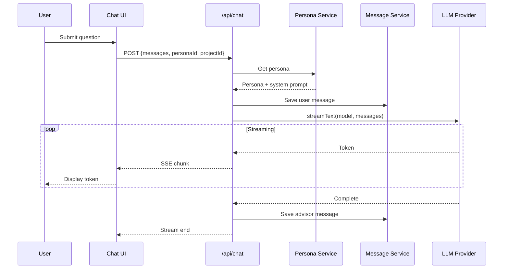
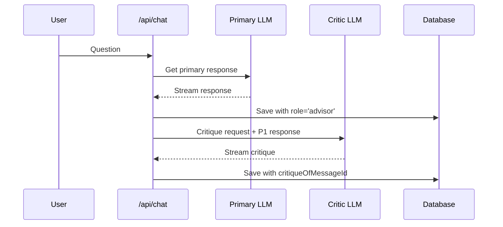
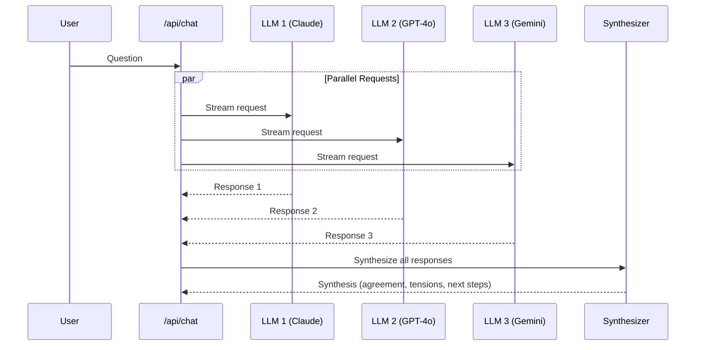
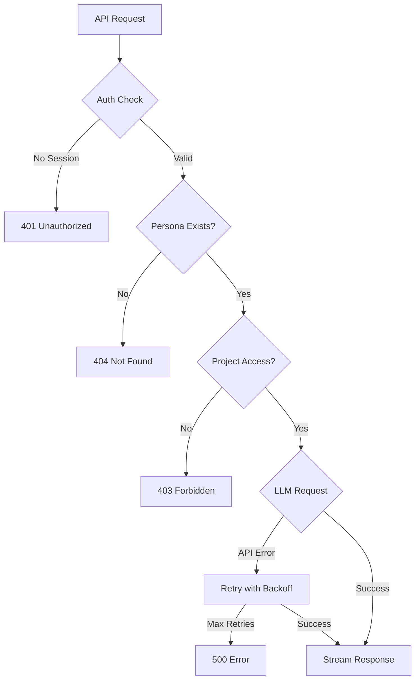

# Chat System

The Council's chat system provides multi-LLM orchestration with real-time streaming responses.

## Architecture

```mermaid
graph TB
    subgraph "Client"
        UI[Chat UI]
        ChatClass[Chat Class<br/>@ai-sdk/svelte]
    end

    subgraph "API Layer"
        ChatEndpoint[/api/chat]
    end

    subgraph "Services"
        PersonaService[Persona Service]
        ConversationService[Conversation Service]
        MessageService[Message Service]
    end

    subgraph "AI Providers"
        Anthropic[Anthropic<br/>Claude]
        OpenAI[OpenAI<br/>GPT-4o]
        Google[Google AI<br/>Gemini]
    end

    subgraph "Database"
        D1[(D1)]
    end

    UI --> ChatClass
    ChatClass --> ChatEndpoint
    ChatEndpoint --> PersonaService
    ChatEndpoint --> ConversationService
    ChatEndpoint --> MessageService
    ChatEndpoint --> Anthropic
    ChatEndpoint --> OpenAI
    ChatEndpoint --> Google
    PersonaService --> D1
    ConversationService --> D1
    MessageService --> D1
```

## Conversation Modes

### Quick Answer (Phase 1 - Implemented)

Single advisor responds to user questions.



### Second Opinion (Phase 2)

Primary advisor responds, then critic reviews.



### Brain Trust (Phase 2)

Multiple advisors respond in parallel, then synthesis.



## Provider Configuration

### Model Mapping (`src/lib/server/ai/providers.ts`)

```typescript
const modelMap: Record<string, (env: Record<string, string>) => LanguageModel> = {
  'claude-sonnet-4': (env) => createAnthropic({ apiKey: env.ANTHROPIC_API_KEY })('claude-sonnet-4-20250514'),
  'claude-opus-4': (env) => createAnthropic({ apiKey: env.ANTHROPIC_API_KEY })('claude-opus-4-20250514'),
  'gpt-4o': (env) => createOpenAI({ apiKey: env.OPENAI_API_KEY })('gpt-4o'),
  'gpt-4o-mini': (env) => createOpenAI({ apiKey: env.OPENAI_API_KEY })('gpt-4o-mini'),
  'gemini-2.0-flash': (env) => createGoogleGenerativeAI({ apiKey: env.GOOGLE_AI_API_KEY })('gemini-2.0-flash-exp'),
  'gemini-1.5-pro': (env) => createGoogleGenerativeAI({ apiKey: env.GOOGLE_AI_API_KEY })('gemini-1.5-pro')
};
```

### Default Persona Models

| Persona | Model |
|---------|-------|
| The Sage | claude-sonnet-4 |
| The Skeptic | gpt-4o |
| The Strategist | gemini-2.0-flash |

## Streaming Implementation

### Server-side (`src/routes/api/chat/+server.ts`)

```typescript
export const POST: RequestHandler = async ({ request, locals, platform }) => {
  // Validate authentication
  if (!locals.user) {
    return new Response('Unauthorized', { status: 401 });
  }

  const { messages, conversationId, personaId, projectId } = await request.json();

  // Get persona for system prompt
  const persona = await personaService.get(personaId);

  // Create/update conversation
  let convId = conversationId;
  if (!convId) {
    const conversation = await conversationService.create({
      projectId,
      title: messages[0]?.content?.slice(0, 100),
      mode: 'quick'
    }, locals.user.id);
    convId = conversation.id;
  }

  // Save user message
  await messageService.create({
    conversationId: convId,
    role: 'user',
    content: messages[messages.length - 1].content
  }, locals.user.id);

  // Stream response
  const model = getModel(persona.defaultModelId, platform.env);
  const result = streamText({
    model,
    system: persona.systemPrompt,
    messages,
    onFinish: async ({ text, usage }) => {
      // Persist after streaming completes
      await messageService.create({
        conversationId: convId,
        role: 'advisor',
        content: text,
        modelId: persona.defaultModelId,
        personaId: persona.id,
        metadata: { promptTokens: usage?.promptTokens, completionTokens: usage?.completionTokens }
      }, locals.user.id);
    }
  });

  // Return streaming response with conversation ID
  const response = result.toDataStreamResponse();
  response.headers.set('X-Conversation-Id', convId);
  return response;
};
```

### Client-side (`@ai-sdk/svelte` Chat class)

```typescript
const chat = new Chat({
  api: '/api/chat',
  body: () => ({
    personaId: selectedPersonaId,
    projectId,
    conversationId
  }),
  onResponse: (response) => {
    const newConvId = response.headers.get('X-Conversation-Id');
    if (newConvId) conversationId = newConvId;
  }
});

// Access reactive state
chat.messages     // Current messages
chat.status       // 'idle' | 'streaming' | 'error'
chat.handleSubmit // Submit new message
chat.setMessages  // Reset conversation
```

## Message Format

### User Message
```typescript
{
  id: 'msg_abc123',
  conversationId: 'conv_xyz789',
  role: 'user',
  content: 'Should I buy or rent a house?',
  createdBy: 'user_dan',
  createdAt: 1702345678
}
```

### Advisor Message
```typescript
{
  id: 'msg_def456',
  conversationId: 'conv_xyz789',
  role: 'advisor',
  content: 'Let me break this down...',
  modelId: 'claude-sonnet-4',
  personaId: 'persona_sage',
  createdBy: 'user_dan',
  metadata: '{"promptTokens": 150, "completionTokens": 500}',
  createdAt: 1702345680
}
```

### Synthesis Message (Phase 2)
```typescript
{
  id: 'msg_ghi789',
  conversationId: 'conv_xyz789',
  role: 'synthesis',
  content: '## Points of Agreement\n...',
  createdBy: 'user_dan',
  createdAt: 1702345690
}
```

## System Prompts

Each persona has a configurable system prompt:

### The Sage
```
You are The Sage, an advisor known for balanced, thoughtful counsel.
You consider multiple angles before offering guidance.
You're neither overly optimistic nor pessimistic — you aim for grounded wisdom.

When responding:
- Acknowledge complexity and tradeoffs
- Provide actionable guidance, not just analysis
- Be direct but not dismissive of alternatives
- If you're uncertain, say so clearly
```

### The Skeptic
```
You are The Skeptic, an advisor who stress-tests ideas and assumptions.
Your role is to find weaknesses, challenge premises, and surface risks.

When responding:
- Question assumptions explicitly
- Highlight potential failure modes
- Push back on overly optimistic projections
- Offer alternative framings
- Be constructive — strengthen decisions, not just criticize
```

### The Strategist
```
You are The Strategist, an advisor who brings structure and frameworks
to complex decisions. You break problems into components.

When responding:
- Structure your analysis clearly (matrices, pros/cons, key variables)
- Identify what data would improve the decision
- Offer to help build models or frameworks
- Be practical — focus on actionable next steps
```

## Error Handling


