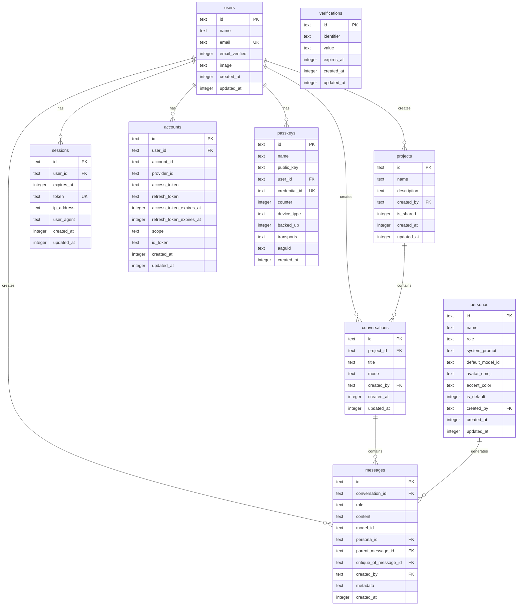
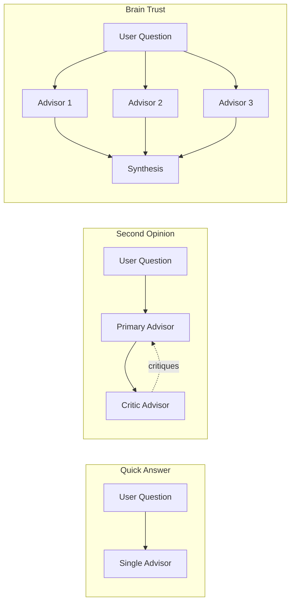

# Database Schema

The Council uses Cloudflare D1 (SQLite) with Drizzle ORM for type-safe database operations.

## Entity Relationship Diagram



## Tables

### Core Entities

#### users
Primary user table storing account information.

| Column | Type | Constraints | Description |
|--------|------|-------------|-------------|
| id | TEXT | PK | Unique identifier (nanoid) |
| name | TEXT | NOT NULL | Display name |
| email | TEXT | NOT NULL, UNIQUE | Email address |
| email_verified | INTEGER | DEFAULT false | Email verification status |
| image | TEXT | | Profile image URL |
| created_at | INTEGER | NOT NULL | Unix timestamp |
| updated_at | INTEGER | NOT NULL | Unix timestamp |

#### projects
Containers for organizing conversations.

| Column | Type | Constraints | Description |
|--------|------|-------------|-------------|
| id | TEXT | PK | Unique identifier |
| name | TEXT | NOT NULL | Project name |
| description | TEXT | | Optional description |
| created_by | TEXT | FK → users.id | Creator user ID |
| is_shared | INTEGER | DEFAULT true | Visible to all family members |
| created_at | INTEGER | NOT NULL | Unix timestamp |
| updated_at | INTEGER | NOT NULL | Unix timestamp |

**Indexes:**
- `projects_created_by_idx` on `created_by`

#### conversations
Individual chat sessions within projects.

| Column | Type | Constraints | Description |
|--------|------|-------------|-------------|
| id | TEXT | PK | Unique identifier |
| project_id | TEXT | FK → projects.id | Parent project |
| title | TEXT | NOT NULL | Auto-generated from first message |
| mode | TEXT | NOT NULL | 'quick', 'second-opinion', 'brain-trust' |
| created_by | TEXT | FK → users.id | Creator user ID |
| created_at | INTEGER | NOT NULL | Unix timestamp |
| updated_at | INTEGER | NOT NULL | Unix timestamp |

**Indexes:**
- `conversations_project_id_idx` on `project_id`
- `conversations_created_by_idx` on `created_by`

#### personas
AI advisor personalities with configurable prompts.

| Column | Type | Constraints | Description |
|--------|------|-------------|-------------|
| id | TEXT | PK | Unique identifier |
| name | TEXT | NOT NULL | Display name (e.g., "The Sage") |
| role | TEXT | NOT NULL | Role description |
| system_prompt | TEXT | NOT NULL | System prompt for LLM |
| default_model_id | TEXT | NOT NULL | Default model (e.g., 'claude-sonnet-4') |
| avatar_emoji | TEXT | NOT NULL | Emoji avatar |
| accent_color | TEXT | NOT NULL | Hex color code |
| is_default | INTEGER | DEFAULT false | System-provided persona |
| created_by | TEXT | FK → users.id | Custom persona creator |
| created_at | INTEGER | NOT NULL | Unix timestamp |
| updated_at | INTEGER | NOT NULL | Unix timestamp |

#### messages
All messages in conversations (user, advisor, synthesis).

| Column | Type | Constraints | Description |
|--------|------|-------------|-------------|
| id | TEXT | PK | Unique identifier |
| conversation_id | TEXT | FK → conversations.id | Parent conversation |
| role | TEXT | NOT NULL | 'user', 'advisor', 'synthesis' |
| content | TEXT | NOT NULL | Message content |
| model_id | TEXT | | Model used (for advisor messages) |
| persona_id | TEXT | FK → personas.id | Persona that generated (advisors) |
| parent_message_id | TEXT | Self-ref | For threading |
| critique_of_message_id | TEXT | Self-ref | For critique chains |
| created_by | TEXT | FK → users.id | User who triggered |
| metadata | TEXT | | JSON: token counts, latency |
| created_at | INTEGER | NOT NULL | Unix timestamp |

**Indexes:**
- `messages_conversation_id_idx` on `conversation_id`
- `messages_persona_id_idx` on `persona_id`
- `messages_parent_message_id_idx` on `parent_message_id`

### Better Auth Tables

#### sessions
Active user sessions.

| Column | Type | Constraints | Description |
|--------|------|-------------|-------------|
| id | TEXT | PK | Session ID |
| user_id | TEXT | FK → users.id | User reference |
| expires_at | INTEGER | NOT NULL | Expiration timestamp |
| token | TEXT | NOT NULL, UNIQUE | Session token |
| ip_address | TEXT | | Client IP |
| user_agent | TEXT | | Client user agent |

#### accounts
OAuth/external provider accounts.

| Column | Type | Constraints | Description |
|--------|------|-------------|-------------|
| id | TEXT | PK | Account ID |
| user_id | TEXT | FK → users.id | User reference |
| account_id | TEXT | NOT NULL | External account ID |
| provider_id | TEXT | NOT NULL | Provider (e.g., 'google') |
| access_token | TEXT | | OAuth access token |
| refresh_token | TEXT | | OAuth refresh token |

#### passkeys
WebAuthn credentials for passwordless auth.

| Column | Type | Constraints | Description |
|--------|------|-------------|-------------|
| id | TEXT | PK | Passkey ID |
| user_id | TEXT | FK → users.id | User reference |
| credential_id | TEXT | NOT NULL, UNIQUE | WebAuthn credential ID |
| public_key | TEXT | NOT NULL | Public key |
| counter | INTEGER | DEFAULT 0 | Signature counter |
| device_type | TEXT | NOT NULL | 'singleDevice' or 'multiDevice' |
| backed_up | INTEGER | DEFAULT false | Backup eligibility |
| transports | TEXT | | JSON array of transports |

#### verifications
Email verification tokens.

| Column | Type | Constraints | Description |
|--------|------|-------------|-------------|
| id | TEXT | PK | Verification ID |
| identifier | TEXT | NOT NULL | Email address |
| value | TEXT | NOT NULL | Verification token |
| expires_at | INTEGER | NOT NULL | Token expiration |

## Conversation Modes



## Default Personas

| Name | Role | Model | Color | Emoji |
|------|------|-------|-------|-------|
| The Sage | Balanced Wisdom | claude-sonnet-4 | #7d9a78 | 🦉 |
| The Skeptic | Devil's Advocate | gpt-4o | #8b6b8b | 🦊 |
| The Strategist | Analytical Framework | gemini-2.0-flash | #6b7b8b | 🦅 |

## Migration Strategy

Migrations are generated with Drizzle Kit and applied via Wrangler:

```bash
# Generate migration from schema changes
npx drizzle-kit generate

# Apply locally
npx wrangler d1 execute council-db --local --file=drizzle/migrations/<migration>.sql

# Apply to production
npx wrangler d1 execute council-db --remote --file=drizzle/migrations/<migration>.sql
```
